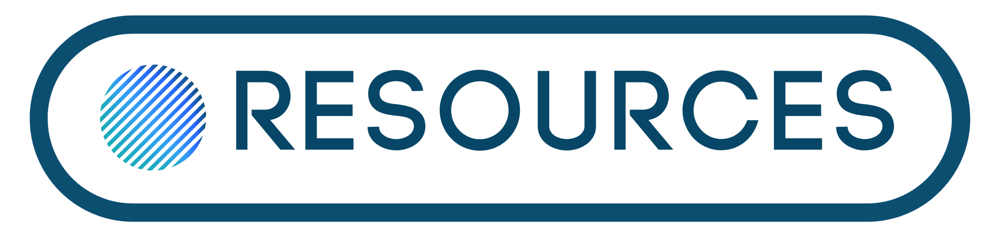

<p align="center">
  <br>
  <a href="https://getresources.ml">
    
  </a>
</p>

<p align="center">
All About Free Resources On Internet
</p>

<p align="center">
  <a title="MIT License" href="LICENSE">
    
  </a>
  <a title="e" href="LICENSE">
    
  </a>
  <br>
  <br>
</p>


### :beginner: Project Structure
A quick look at the top-level files and directories you'll see in this project.

```console
.
├── angular.html
├── assets
│   ├── css
│   │   ├── main.css
│   │   ├── style.css
│   │   ├── style.css.map
│   │   └── style.scss
│   ├── csv
│   ├── favicons
│   │   └── fav-icon.png
│   ├── img
│   │   ├── home-banner.svg
│   │   ├── logo
│   │   │   ├── cropped-resources-logo-top.png
│   │   │   └── resources-logo.png
│   │   ├── meta-banner.png
│   │   ├── pre-loader-1.gif
│   │   └── pre-loader.gif
│   └── js
│       └── main.js
├── CNAME
├── color-pickers.html
├── css-frameworks.html
├── design-and-graphics.html
├── favicons.html
├── header.html
├── html-and-css-templates.html
├── icons.html
├── illustrations.html
├── image-editors.html
├── image-optimizer.html
├── index.html
├── invoices.html
├── js-animations.html
├── learn.html
├── LICENSE
├── others.html
├── package.json
├── package-lock.json
├── react.html
├── README.md
├── scalable-vector-graphics.html
├── search-engine-optimization.html
├── sidebar.html
├── stock-photography.html
├── stock-video.html
├── tailwind.config.js
├── tailwindcss-framework.html
├── typography-and-fonts.html
└── vue.html


```

### :book: Data Sources

This project collects data from various sources such as blogs, social media platforms, user submission etc and store them on a google sheet. This google sheet is used to fetch all the data to frontend part.

### :gift: Want to add a new category?

Want to add a new category in the project then :
1. Fork this repository.
2. Duplicate any category file (for e.g react.html).
3. Rename the file in small letters spearted by hyphen ( - ) if the category name is having more than one word.
4. **No need to change title or anything in the duplicated file, every thing will be added automatically through the JS with the help of filename itself.**
5. Go to sidebar.html file and add with proper icon with it. Get the icon list <a href="https://ionicons.com/">here</a>.
6. Submit the category's resources on this <a href="https://forms.gle/f2F89yQqj33Gt7gg6">link</a> and it will be updated in some time after review. **OR** submit a CSV file with the PR in assets/csv/your-github-username.csv and it will be merged and updated upon verification.
7. Create a pull request and submit it.

### :pencil: Contribute Design

Want to add some UI features then :
1. Fork this repository.
2. Make your UI changes
3. Create a pull request with proper screenshot with the submitted PR.

### :dart: Contribute Resources

You can submit your resources on this <a href="https://forms.gle/f2F89yQqj33Gt7gg6">link</a> and it will be updated in some time after review.
